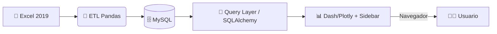

# Guía de Implementación (Profesional) — v2.0 📝
**Dashboard de Mortalidad — Colombia (2019)**  
**Equipo:** Juan Castillo · Maria Alejandra Gómez Piedrahita  
**Versión:** 2.0.0 · **Última actualización:** 2025-10-25

[](https://github.com/)
[](LICENSE)
[](https://peps.python.org/pep-0008/)

---

## 📌 Estado del proyecto — Seguimiento
Panel rápido de seguimiento. Marca el progreso (cambia `[ ]` → `[x]`).

| ID | Tarea | Responsable | Estado | Notas |
| ---: | --- | --- | :---: | --- |
| 0 | Repositorio GitHub | Infra / Docs | [x] | https://github.com/jmmana/analisis_mortalidad_colombia.git |
| 1 | Guía de Implementación (este doc) | Docs | [x] | v2 con navegación lateral y explicativos por gráfico |
| 2 | Fase I — Preparación & Infra (MySQL, data/) | Equipo | [ ] | Crear DB, poblar `data/` con Excel |
| 3 | Fase II — ETL y Back-end (Python) | Equipo | [ ] | Scripts ETL, validadores y pruebas |
| 4 | Fase III — Dashboard (Dash/Plotly) | Equipo | [ ] | Menú lateral, 7 visualizaciones, explicativos |
| 5 | Fase IV — Contenerización (Docker) | Equipo | [ ] | Dockerfile y docker-compose |
| 6 | Fase V — Despliegue (PaaS) | Equipo | [ ] | Render/Railway/GAE/AWS |
| 7 | Tests y CI/CD | Equipo | [ ] | GitHub Actions, pytest |
| 8 | README con capturas & hallazgos | Docs | [ ] | Incluye URLs de app y repo |

---

## ✨ Resumen ejecutivo
Documento técnico listo para ejecución por un equipo de ingeniería. Entrega: contrato del sistema, arquitectura, ETL, diseño del dashboard con **menú lateral (left sidebar)** que permite elegir **cada gráfico** y **ver debajo de cada gráfico una explicación** de los datos, contenerización y despliegue PaaS.

Objetivo: clonar, ejecutar local, validar datos y publicar en la nube con trazabilidad y buena presentación.

---

## 📚 Tabla de contenidos
1. [Contrato técnico (inputs/outputs/éxito)](#contrato-técnico)
2. [Arquitectura de la solución](#arquitectura-de-la-solución)
3. [Requisitos y versiones](#requisitos-y-versiones)
4. [Estructura del repositorio](#estructura-del-repositorio)
5. [Preparación del entorno (PowerShell)](#preparación-del-entorno-powershell)
6. [Base de datos — Esquema y recomendaciones](#base-de-datos)
7. [ETL — Diseño y ejemplos (Python)](#etl)
8. [Dashboard con menú lateral — UX, layout y callbacks](#dashboard-con-menú-lateral)
9. [Contenerización (Docker) y docker-compose](#contenerización)
10. [CI/CD (GitHub Actions)](#cicd-github-actions)
11. [Pruebas y validación](#pruebas-y-validación)
12. [Observabilidad y logging](#observabilidad-y-logging)
13. [Seguridad y manejo de secretos](#seguridad)
14. [Resolución de problemas frecuentes](#resolución-de-problemas-frecuentes)
15. [Entrega: README y comentario para el aula](#entrega-readme-y-comentario-para-el-aula)
16. [Apéndices: SQL y mapeos](#apéndices)
17. [Guía de estilo Markdown](#guía-de-estilo-markdown)

---

## 1) 🔌 Contrato técnico
**Inputs**
- Excel en `data/`: `NoFetal2019.xlsx`, `CodigosDeMuerte.xlsx`, `Divipola.xlsx`.
- Variables de entorno: DB, puerto, modo.

**Outputs**
- Tablas normalizadas en MySQL: `muertes`, `causas`, `divipola`.
- App Dash accesible (puerto por defecto 8050) con **7 visualizaciones** y **explicativos**.

**Criterios de éxito**
1) ETL sin errores y conteos válidos (>0 registros y checks).  
2) Visualizaciones correctas y navegables desde el **menú lateral**.  
3) Despliegue PaaS público y funcional.  
4) README con capturas + hallazgos y enlaces (app/repo).

---

## 2) 🏗️ Arquitectura de la solución

Notas: la capa de consulta puede integrarse en la app. Indexar columnas filtrables.

---

## 3) ✅ Requisitos y versiones
- Python 3.10+ · Docker 20.10+ · MySQL 8.0
- `requirements.txt` (mínimo):
```
pandas==2.2.2
openpyxl==3.1.5
SQLAlchemy==2.0.36
pymysql==1.1.1
dash==2.17.1
plotly==5.24.1
python-dotenv==1.0.1
gunicorn==22.0.0
pytest==8.3.2
```
> Congelar versiones para reproducibilidad.

---

## 4) 📁 Estructura del repositorio
```
.
├── app.py
├── requirements.txt
├── Dockerfile
├── docker-compose.yml
├── .env.example
├── assets/
│   └── style.css
├── data/
├── etl/
│   ├── load_data.py
│   ├── transform.py
│   └── validators.py
├── src/
│   ├── db.py
│   ├── queries.py
│   └── dashboard/
│       ├── layout.py
│       ├── callbacks.py
│       └── components.py
├── tests/
├── config/
│   └── schema.sql
└── README.md
```

---

## 5) 🛠️ Preparación del entorno (PowerShell)
```powershell
git clone <TU_REPO_URL>
cd <TU_REPO_DIR>

python -m venv .venv
.\.venv\Scripts\Activate.ps1
python -m pip install --upgrade pip
pip install -r requirements.txt

copy .env.example .env
# Edita .env con tu configuración
```
`.env.example`:
```
DB_HOST=localhost
DB_PORT=3306
DB_NAME=mortalidad_db
DB_USER=mortalidad_user
DB_PASS=mortalidad_pass
APP_PORT=8050
```

---

## 6) 🗄️ Base de datos
`config/schema.sql`:
```sql
CREATE DATABASE IF NOT EXISTS mortalidad_db;
USE mortalidad_db;

CREATE TABLE IF NOT EXISTS causas (
  codigo VARCHAR(10) PRIMARY KEY,
  descripcion VARCHAR(255) NOT NULL
);

CREATE TABLE IF NOT EXISTS divipola (
  id INT PRIMARY KEY AUTO_INCREMENT,
  departamento VARCHAR(100),
  municipio VARCHAR(100),
  codigo_divipola VARCHAR(20)
);

CREATE TABLE IF NOT EXISTS muertes (
  id BIGINT PRIMARY KEY AUTO_INCREMENT,
  fecha DATE,
  departamento VARCHAR(100),
  municipio VARCHAR(100),
  sexo CHAR(1),
  edad INT,
  grupo_edad VARCHAR(50),
  codigo_causa VARCHAR(10),
  FOREIGN KEY (codigo_causa) REFERENCES causas(codigo)
);

CREATE INDEX idx_muertes_departamento ON muertes(departamento);
CREATE INDEX idx_muertes_fecha ON muertes(fecha);
CREATE INDEX idx_muertes_sexo ON muertes(sexo);
```
Buenas prácticas: privilegios mínimos, migrations con Alembic si el proyecto crece.

---

## 7) 🧰 ETL
`etl/load_data.py` (esqueleto):
```python
import argparse, pandas as pd
from sqlalchemy import create_engine, text

def read_excel(path): return pd.read_excel(path, engine="openpyxl")

def transform_muertes(df):
    df = df.rename(columns=lambda c: c.strip().lower())
    # Ejemplos de normalización esperada (ajusta a tus nombres reales):
    df["fecha"] = pd.to_datetime(df["fecha"], errors="coerce")
    df = df.dropna(subset=["fecha"])
    # Mapear GRUPO_EDAD1 a categorías legibles si está presente
    return df

def load(df, table, engine):
    df.to_sql(table, engine, if_exists="append", index=False, chunksize=5000)

def main(args):
    engine = create_engine(args.db_url)
    muertes = read_excel(f"{args.data_dir}/NoFetal2019.xlsx")
    muertes = transform_muertes(muertes)
    load(muertes, "muertes", engine)

if __name__ == "__main__":
    p = argparse.ArgumentParser()
    p.add_argument("--data-dir", required=True)
    p.add_argument("--db-url", required=True)
    a = p.parse_args()
    main(a)
```

Validadores (`etl/validators.py`):
```python
def check_row_counts(df, min_rows=1):
    if len(df) < min_rows: raise ValueError("Dataset demasiado pequeño")

def check_columns(df, expected):
    missing = set(expected) - set(df.columns)
    if missing: raise ValueError(f"Faltan columnas: {missing}")
```
Pruebas: `pytest` con fixtures mínimos y mocks de I/O.

---

## 8) 📊 Dashboard con **menú lateral**
### 8.1 UX requerida
- **Barra lateral izquierda (sidebar fija)** con 7 ítems, uno por cada visualización.
- **Zona de contenido**: al seleccionar un ítem, se muestra el **gráfico** y **debajo** un **bloque explicativo** (texto dinámico con hallazgos/definiciones).
- **Filtros globales** (opcional): año (2019 fijo), departamento, sexo, etc.
- Estilo profesional: tipografía limpia, cards con sombras suaves, títulos claros y leyendas legibles.

**Items del menú (7):**
1. **Mapa** — Muertes por departamento (2019).
2. **Líneas** — Muertes por mes (variación anual).
3. **Barras (Top 5 violentas)** — Homicidios (X95 y afines).
4. **Circular (Bottom 10)** — 10 ciudades con menor mortalidad.
5. **Tabla (Top 10 causas)** — Código, nombre y total.
6. **Barras apiladas** — Muertes por sexo × departamento.
7. **Histograma (GRUPO_EDAD1)** — Distribución por etapas de vida.

### 8.2 Código de layout (`src/dashboard/layout.py`)
```python
from dash import html, dcc

def sidebar():
    return html.Div(
        id="sidebar",
        children=[
            html.H2("Mortalidad 2019", className="brand"),
            html.Div("Explora los datos de Colombia", className="subtitle"),
            html.Hr(),
            dcc.RadioItems(
                id="menu",
                options=[
                    {"label": "Mapa por departamento", "value": "map"},
                    {"label": "Líneas por mes", "value": "lines"},
                    {"label": "Top 5 ciudades violentas", "value": "bars_top5"},
                    {"label": "Bottom 10 ciudades (circular)", "value": "pie_bottom10"},
                    {"label": "Top 10 causas (tabla)", "value": "table_top10_causes"},
                    {"label": "Sexo × Depto (apiladas)", "value": "stacked_sex_dept"},
                    {"label": "Histograma GRUPO_EDAD1", "value": "hist_age_groups"},
                ],
                value="map",
                className="menu",
                inputClassName="menu-input",
                labelClassName="menu-label",
            ),
        ],
        className="sidebar",
    )

def content():
    return html.Div(
        id="content",
        children=[
            html.Div(id="graph_card", className="card"),
            html.Div(id="explanation_card", className="card explanation"),
        ],
        className="content",
    )

def layout():
    return html.Div(
        [sidebar(), content()],
        className="container"
    )
```

### 8.3 Callbacks (`src/dashboard/callbacks.py`)
```python
from dash import Input, Output, html, dcc
import plotly.express as px
import pandas as pd

def register_callbacks(app, df_muertes, df_causas, df_divipola):
    @app.callback(
        Output("graph_card", "children"),
        Output("explanation_card", "children"),
        Input("menu", "value"),
    )
    def render_view(view):
        if view == "map":
            fig = px.choropleth( # requiere merge con GeoJSON de Colombia
                # data_frame=...,
                # locations="departamento", color="total",
                # featureidkey="properties.NOMBRE_DPT",
                # geojson=colombia_geojson
            )
            explanation = html.Div([
                html.H3("Mapa — Muertes por departamento (2019)"),
                html.P("Descripción: distribución total de muertes por departamento."),
                html.Ul([
                    html.Li("Fuente: DANE — EEVV 2019"),
                    html.Li("Interpretación: identificar departamentos con mayor/menor carga."),
                ])
            ])
            return dcc.Graph(figure=fig), explanation

        elif view == "lines":
            # df = df_muertes.groupby(df_muertes["fecha"].dt.to_period("M")).size().reset_index(name="total")
            # df["fecha"] = df["fecha"].dt.to_timestamp()
            # fig = px.line(df, x="fecha", y="total", markers=True)
            explanation = html.Div([
                html.H3("Líneas — Muertes por mes"),
                html.P("Serie mensual para observar variaciones intra-anuales."),
            ])
            return html.Div("TODO: gráfico de líneas"), explanation

        # ...repetir para bars_top5, pie_bottom10, table_top10_causes, stacked_sex_dept, hist_age_groups
        return html.Div("Seleccione una vista"), html.Div("")
```

### 8.4 App factory (`src/dashboard/__init__.py`)
```python
from dash import Dash
from .layout import layout
from .callbacks import register_callbacks

def create_app(df_muertes=None, df_causas=None, df_divipola=None):
    app = Dash(__name__, suppress_callback_exceptions=True)
    app.title = "Mortalidad Colombia 2019"
    app.layout = layout()
    register_callbacks(app, df_muertes, df_causas, df_divipola)
    return app.server
```

### 8.5 `app.py`
```python
import os
from src.dashboard import create_app

app = create_app()

if __name__ == "__main__":
    app.run_server(host="0.0.0.0", port=int(os.getenv("APP_PORT", 8050)), debug=True)
```

### 8.6 Estilos (`assets/style.css`)
```css
:root { --bg:#0f172a; --card:#111827; --text:#e5e7eb; --accent:#22d3ee; }
*{box-sizing:border-box} body{margin:0;background:var(--bg);color:var(--text);font-family:Inter,system-ui,-apple-system,Segoe UI,Roboto,Ubuntu}
.container{display:flex;min-height:100vh}
.sidebar{width:300px;padding:24px;background:#0b1220;border-right:1px solid #1f2937;position:sticky;top:0;height:100vh}
.brand{margin:0 0 4px 0} .subtitle{opacity:.8;margin-bottom:12px}
.menu .menu-label{display:block;margin:10px 0;cursor:pointer}
.content{flex:1;padding:24px}
.card{background:var(--card);border:1px solid #1f2937;border-radius:16px;padding:20px;box-shadow:0 2px 12px rgba(0,0,0,.15);margin-bottom:16px}
.explanation h3{margin-top:0}
a{color:var(--accent)}
```

> **Nota:** El **texto explicativo** se actualiza dinámicamente por cada gráfico. Incluye fuente, definiciones de variables, hallazgos rápidos y consideraciones de interpretación (estacionalidad, outliers, diferencias regionales).

---

## 9) 🐳 Contenerización
`Dockerfile`:
```dockerfile
FROM python:3.10-slim
WORKDIR /app
ENV PYTHONDONTWRITEBYTECODE=1 PYTHONUNBUFFERED=1
COPY requirements.txt ./
RUN pip install --no-cache-dir -r requirements.txt
COPY . .
EXPOSE 8050
CMD ["gunicorn","app:app","-b","0.0.0.0:8050","--workers","4"]
```

`docker-compose.yml`:
```yaml
version: "3.8"
services:
  db:
    image: mysql:8.0
    restart: always
    environment:
      MYSQL_ROOT_PASSWORD: rootpassword
      MYSQL_DATABASE: mortalidad_db
      MYSQL_USER: mortalidad_user
      MYSQL_PASSWORD: mortalidad_pass
    ports: ["3306:3306"]
    volumes: [ "db_data:/var/lib/mysql" ]

  app:
    build: .
    depends_on: [ db ]
    ports: ["8050:8050"]
    env_file: .env
volumes: { db_data: {} }
```

Comandos:
```powershell
docker compose up --build -d
docker compose logs -f app
```

---

## 10) 🧪 CI/CD (GitHub Actions)
`.github/workflows/ci.yml`:
```yaml
name: CI
on: [push, pull_request]
jobs:
  test:
    runs-on: ubuntu-latest
    steps:
      - uses: actions/checkout@v4
      - uses: actions/setup-python@v4
        with: { python-version: "3.10" }
      - run: python -m pip install --upgrade pip && pip install -r requirements.txt
      - run: pytest -q
```

---

## 11) ✅ Pruebas y validación
- Unit tests a transformaciones ETL.
- Smoke test: arranque de la app y render de cada vista.
- Integración: levantar MySQL en `docker-compose` y ejecutar ETL sobre un subconjunto.

---

## 12) 📈 Observabilidad y logging
- Logging estructurado en ETL y app (nivel INFO/ERROR).
- Métricas opcionales.
- Centralización futura (ELK/Loki).

---

## 13) 🔐 Seguridad y secretos
- `.env` local (no versionar). En PaaS: **Secrets**.
- Usuario DB de privilegios mínimos.

---

## 14) 🛠️ Resolución de problemas
- **GeoJSON/Mapa**: asegurar correspondencia exacta entre nombre/código de departamento y la llave del GeoJSON.
- **Excel**: `engine='openpyxl'` y rutas correctas.
- **Permisos**: en PaaS, exponer `APP_PORT` y `web service` activo.

---

## 15) 📦 Entrega: README y comentario para el aula
**README (plantilla mínima):**
- Introducción, Objetivo, Estructura del proyecto.
- Requisitos, Instalación, Ejecución local.
- **Visualizaciones (7)** con **capturas** y **explicación bajo cada una**.
- Despliegue (pasos) y **URLs** (app y repo).

**Comentario para el aula (copiar/pegar):**
```
Integrantes: Juan Castillo · Maria Alejandra Gómez Piedrahita
Aplicación: https://<tu-app>.onrender.com
Repositorio: https://github.com/jmmana/analisis_mortalidad_colombia
```

---

## 16) 📎 Apéndices
**Consulta genérica:** muertes por departamento
```sql
SELECT departamento, COUNT(*) AS total
FROM muertes
GROUP BY departamento
ORDER BY total DESC;
```

**Mapeo GRUPO_EDAD1 → categorías (DANE aproximadas):**
- 0–4  → Mortalidad neonatal (menor de 1 mes)
- 5–6  → Mortalidad infantil (1 a 11 meses)
- 7–8  → Primera infancia (1 a 4 años)
- 9–10 → Niñez (5 a 14 años)
- 11   → Adolescencia (15 a 19 años)
- 12–13→ Juventud (20 a 29 años)
- 14–16→ Adultez temprana (30 a 44 años)
- 17–19→ Adultez intermedia (45 a 59 años)
- 20–24→ Vejez (60 a 84 años)
- 25–28→ Longevidad (85 a 100+)
- 29   → Edad desconocida

---

## 17) 🖋️ Guía de estilo Markdown
- Un solo H1 por documento, títulos claros, tablas limpias.
- Usar bloques de código con lenguaje.
- Emojis moderados y útiles.
- Checklist final de entrega:

**Checklist rápido**
- [ ] `requirements.txt` fijo
- [ ] `assets/style.css` con sidebar profesional
- [ ] 7 visualizaciones y **explicación bajo cada gráfico**
- [ ] Dockerfile + docker-compose
- [ ] Despliegue PaaS público
- [ ] README con capturas y links
- [ ] Comentario de entrega con integrantes + URLs
