---
# Guía de Implementación (Profesional) 📝
**Dashboard de Mortalidad — Colombia**

> Versión: 1.0.0  ·  Última actualización: 2025-10-24

[](https://github.com/)
[](https://github.com/)
[](LICENSE)

---

## 📌 Estado del proyecto — Seguimiento

Esta tabla sirve como panel rápido de seguimiento. Edita la casilla de la columna "Estado" para marcar el progreso (p. ej. cambiar `[ ]` por `[x]`).

| ID | Tarea | Responsable | Estado | Notas |
| ---: | --- | --- | :---: | --- |
| 0 | Repositorio GitHub | Infra / Docs | [x] | https://github.com/jmmana/analisis_mortalidad_colombia.git |
| 1 | Guía de Implementación (documento) | Docs | [x] | Guía profesional y guía de estilo integradas — ver repo en ID 0 |
| 2 | Fase I — Preparación e infraestructura (MySQL, data) | Equipo | [ ] | Crear DB, estructura `data/` |
| 3 | Fase II — ETL y Back-end (Python) | Equipo | [ ] | Scripts ETL y normalización |
| 4 | Fase III — Dashboard (Dash/Plotly) | Equipo | [ ] | Implementar visualizaciones e interactividad |
| 5 | Fase IV — Contenerización (Docker) | Equipo | [ ] | Dockerfile y docker-compose para dev |
| 6 | Fase V — Despliegue (PaaS) | Equipo | [ ] | Deploy en Render/Railway/Heroku u otro |
| 7 | Tests y CI/CD | Equipo | [ ] | GitHub Actions, pytest, integraciones |
| 8 | Documentación final y entrega | Docs | [ ] | README, capturas, nota de entrega |

**Cómo usarla:**
- Para marcar una tarea como completada edita la celda "Estado" y cambia `[ ]` por `[x]`.
- Para indicar en progreso usa un emoji: `[⏳]` o `[🚧]`.
- Mantén la columna "Notas" actualizada con enlaces a PRs, issues o commits.

---

## ✨ Resumen ejecutivo (para líderes técnicos)

Documento técnico orientado a ingenieros. Contiene: contrato del sistema, arquitectura de alto nivel (diagramas), requisitos del entorno, esquema de base de datos, guía completa de ETL, estructura de la aplicación Dash/Plotly, contenerización (Docker), CI/CD (GitHub Actions), pruebas, métricas y pautas de despliegue.

Objetivo: permitir que un equipo de ingeniería clone el repositorio, ejecute el entorno de desarrollo de forma reproducible y prepare una ruta segura al entorno de producción.

---

## 📚 Tabla de contenidos

1. [Contrato técnico (inputs/outputs)](#contrato-t%C3%A9cnico)
2. [Arquitectura de la solución](#arquitectura-de-la-soluci%C3%B3n)
3. [Requisitos y versiones](#requisitos-y-versiones)
4. [Estructura del repositorio](#estructura-del-repositorio)
5. [Preparación del entorno (PowerShell)](#preparaci%C3%B3n-del-entorno-powershell)
6. [Base de datos — Esquema y recomendaciones](#base-de-datos)
7. [ETL — Diseño y ejemplos (Python)](#etl)
8. [Aplicación Dash — Estructura y arranque](#aplicaci%C3%B3n-dash)
9. [Contenerización (Docker) y docker-compose](#contenerizaci%C3%B3n)
10. [CI/CD básico — GitHub Actions](#cicd-github-actions)
11. [Pruebas y validación](#pruebas-y-validaci%C3%B3n)
12. [Observabilidad y logging](#observabilidad-y-logging)
13. [Seguridad y manejo de secretos](#seguridad)
14. [Resolución de problemas frecuentes](#resoluci%C3%B3n-de-problemas-frecuentes)
15. [Contribución, PR template y release notes](#contribuci%C3%B3n)
16. [Apéndices: SQL útiles y mappings](#ap%C3%A9ndices)
17. [Guía de estilo Markdown (VS Code) 🖋️](#gu%C3%ADa-de-estilo-markdown-vs-code)

---

## 1) 🔌 Contrato técnico (inputs / outputs / criterios de éxito)

- Inputs:
	- Archivos Excel en `data/`: `NoFetal2019.xlsx`, `CodigosDeMuerte.xlsx`, `Divipola.xlsx`.
	- Variables de entorno: credenciales DB, puerto, claves.

- Outputs:
	- Tablas normalizadas en MySQL: `muertes`, `causas`, `divipola`.
	- Dashboard web desplegado en puerto configurable (por defecto 8050).

- Formatos esperados:
	- Fechas: ISO (YYYY-MM-DD) en la base de datos.
	- Códigos de causa: string (ej.: `X95`).

- Criterios de éxito (validation):
	1. ETL completa sin errores y con row counts esperados (>0 registros y checks básicos pasados).
	2. Dashboard muestra datos coherentes (mapa con departamentos, tablas con top causas).
	3. Tests unitarios críticos pasan (meta: >= 90% cobertura para funciones ETL críticas).

- Modo de fallo: archivos faltantes, cambios en el formato del Excel, credenciales DB inválidas, encoding/locale.

---

## 2) 🏗️ Arquitectura de la solución

Diagrama de alto nivel (Mermaid):

```mermaid
flowchart LR
	A[📁 Archivos Excel] --> B(🐍 ETL Python)
	B --> C[(🗄️ MySQL)]
	C --> D[🔎 API / Query layer]
	D --> E[📊 Dash/Plotly Frontend]
	E -->|Navegador| User[👩‍💻 Usuario]
	subgraph infra
		C
	end
```



Notas:
- ETL valida y normaliza los datos antes de persistir.
- La capa de consulta puede residir dentro de la app o separarse en un microservicio.

---

## 3) ✅ Requisitos y versiones (recomendadas)

- Python: 3.10.x (compatible 3.8+)
- Dependencias principales (fijar versiones en `requirements.txt`):
	- pandas >= 1.5
	- openpyxl >= 3.0
	- sqlalchemy >= 1.4
	- mysql-connector-python o pymysql
	- dash, plotly
	- pytest
- Docker: 20.10+
- MySQL: 5.7 / 8.0

Recomendación: versionar las dependencias para reproducibilidad.

---

## 4) 📁 Estructura del repositorio (sugerida)

```text
.
├── app.py
├── requirements.txt
├── Dockerfile
├── docker-compose.yml
├── data/
├── etl/
│   ├── load_data.py
│   ├── transform.py
│   └── validators.py
├── src/
│   ├── db.py
│   ├── queries.py
│   └── dashboard/
├── tests/
├── config/
│   └── schema.sql
└── Guía Implementacion.md
```

Nota: no subir datos sensibles a Git. Mantener `data/` en `.gitignore` si contiene información privada.

---

## 5) 🛠️ Preparación del entorno (PowerShell)

1) Clonar y acceder al proyecto:

```powershell
git clone <TU_REPO_URL>
cd "Dashboard de Mortalidad"
```

2) Crear y activar entorno virtual:

```powershell
python -m venv .venv
# Activar en PowerShell
.\.venv\Scripts\Activate.ps1
# Si PowerShell bloquea scripts: ejecutar temporalmente
Set-ExecutionPolicy -Scope Process -ExecutionPolicy Bypass
.\.venv\Scripts\Activate.ps1
```

3) Instalar dependencias:

```powershell
python -m pip install --upgrade pip
pip install -r requirements.txt
```

4) Preparar `.env` (no subirlo):

```text
DB_HOST=localhost
DB_PORT=3306
DB_NAME=mortalidad_db
DB_USER=mortalidad_user
DB_PASS=mortalidad_pass
APP_PORT=8050
```

Agregar `.env` a `.gitignore`.

---

## 6) 🗄️ Base de datos — Esquema y recomendaciones

Archivo `config/schema.sql` (mínimo):

```sql
CREATE DATABASE IF NOT EXISTS mortalidad_db;
USE mortalidad_db;

CREATE TABLE IF NOT EXISTS causas (
	codigo VARCHAR(10) PRIMARY KEY,
	descripcion VARCHAR(255) NOT NULL
);

CREATE TABLE IF NOT EXISTS divipola (
	id INT PRIMARY KEY AUTO_INCREMENT,
	departamento VARCHAR(100),
	municipio VARCHAR(100),
	codigo_divipola VARCHAR(20)
);

CREATE TABLE IF NOT EXISTS muertes (
	id BIGINT PRIMARY KEY AUTO_INCREMENT,
	fecha DATE,
	departamento VARCHAR(100),
	municipio VARCHAR(100),
	sexo CHAR(1),
	edad INT,
	grupo_edad VARCHAR(50),
	codigo_causa VARCHAR(10),
	FOREIGN KEY (codigo_causa) REFERENCES causas(codigo)
);
```

Buenas prácticas:
- Indexar columnas usadas en filtros (e.g., `departamento`, `fecha`, `codigo_causa`).
- Usar migrations (Alembic) para cambios de esquema en proyectos en crecimiento.

---

## 7) 🧰 ETL — Diseño, contrato y ejemplos (Python)

Contrato ETL:
- Lee Excel(s) desde `data/`.
- Normaliza nombres y tipos.
- Valida reglas y ranges.
- Inserta / upsert en MySQL (bulk loads recomendados).

Ejemplo (esqueleto) `etl/load_data.py`:

```python
"""ETL: load_data.py
Usage: python etl/load_data.py --data-dir data/ --db-url <db_url>
"""
import argparse
import pandas as pd
from sqlalchemy import create_engine

def read_excel(path):
		return pd.read_excel(path, engine='openpyxl')

def transform(df):
		df = df.rename(columns=str.strip)
		df['fecha'] = pd.to_datetime(df['fecha'], errors='coerce')
		df = df.dropna(subset=['fecha'])
		return df

def load(df, table, engine):
		df.to_sql(table, engine, if_exists='append', index=False, chunksize=5000)

def main(args):
		engine = create_engine(args.db_url)
		df = read_excel(f"{args.data_dir}/NoFetal2019.xlsx")
		df = transform(df)
		load(df, 'muertes', engine)

if __name__ == '__main__':
		parser = argparse.ArgumentParser()
		parser.add_argument('--data-dir', required=True)
		parser.add_argument('--db-url', required=True)
		args = parser.parse_args()
		main(args)
```

Validaciones recomendadas (`etl/validators.py`):

```python
def check_row_counts(df, min_rows=1):
		if len(df) < min_rows:
				raise ValueError('Dataset too small')

def check_columns(df, expected):
		missing = set(expected) - set(df.columns)
		if missing:
				raise ValueError(f'Missing columns: {missing}')
```

Recomendación: ejecutar ETL en modo `--dry-run` para validar transformaciones antes de persistir.

---

## 8) 📊 Aplicación Dash — estructura y arranque

Estructura interna:
- `src/dashboard/layout.py` — layout principal
- `src/dashboard/callbacks.py` — callbacks y lógica
- `src/dashboard/components/` — componentes reutilizables

`app.py` (arranque):

```python
import os
from src.dashboard import create_app

app = create_app()

if __name__ == '__main__':
		app.run_server(host='0.0.0.0', port=int(os.getenv('APP_PORT', 8050)), debug=True)
```

Para producción, usar Gunicorn:

```powershell
gunicorn "app:app" -b 0.0.0.0:8050 --workers 4
```

---

## 9) 🐳 Contenerización — Dockerfile & docker-compose

`Dockerfile` (recomendado):

```dockerfile
FROM python:3.10-slim
WORKDIR /app
ENV PYTHONDONTWRITEBYTECODE=1
ENV PYTHONUNBUFFERED=1
COPY requirements.txt ./
RUN pip install --no-cache-dir -r requirements.txt
COPY . .
EXPOSE 8050
CMD ["gunicorn", "app:app", "-b", "0.0.0.0:8050", "--workers", "4"]
```

`docker-compose.yml` (dev):

```yaml
version: '3.8'
services:
	db:
		image: mysql:8.0
		restart: always
		environment:
			MYSQL_ROOT_PASSWORD: rootpassword
			MYSQL_DATABASE: mortalidad_db
			MYSQL_USER: mortalidad_user
			MYSQL_PASSWORD: mortalidad_pass
		ports:
			- "3306:3306"
		volumes:
			- db_data:/var/lib/mysql

	app:
		build: .
		depends_on:
			- db
		ports:
			- "8050:8050"
		env_file: .env

volumes:
	db_data:
```

Comandos (PowerShell):

```powershell
docker compose up --build -d
docker compose logs -f app
```

---

## 10) 🧪 CI/CD — GitHub Actions (ejemplo básico)

Archivo `.github/workflows/ci.yml` (resumen):

```yaml
name: CI
on: [push, pull_request]
jobs:
	test:
		runs-on: ubuntu-latest
		steps:
			- uses: actions/checkout@v4
			- name: Set up Python
				uses: actions/setup-python@v4
				with:
					python-version: '3.10'
			- name: Install dependencies
				run: |
					python -m pip install --upgrade pip
					pip install -r requirements.txt
			- name: Run tests
				run: pytest -q

	build-and-push:
		needs: test
		runs-on: ubuntu-latest
		if: github.ref == 'refs/heads/main'
		steps:
			- uses: actions/checkout@v4
			- name: Build Docker image
				run: docker build -t mortalidad-dashboard:latest .
			# push image to registry steps omitted (configurar secrets)
```

Nota: configurar secrets para push (DOCKER_USERNAME, DOCKER_PASSWORD).

---

## 11) ✅ Pruebas y validación

- Unit tests: funciones de transformación y validación (pytest).
- Integration test: levantar `docker-compose` con DB temporal y ejecutar ETL + queries.
- Fixtures de test en `tests/fixtures/`.

Ejemplo de test (pytest):

```python
def test_transform_basic():
		df = pd.DataFrame({'fecha':['2020-01-01'], 'edad':[30]})
		out = transform(df)
		assert 'fecha' in out.columns
```

---

## 12) 📈 Observabilidad y logging

- Configurar logging estructurado en ETL y app.
- Exportar métricas (Prometheus) si se necesita monitorización.
- Centralizar logs en ELK/Grafana/Loki en producción.

Ejemplo configuración básica:

```python
import logging
logging.basicConfig(level=logging.INFO, format='%(asctime)s %(levelname)s %(message)s')
```

---

## 13) 🔐 Seguridad y manejo de secretos

- No subir `.env` al repo. Usar secrets del proveedor (Render, Railway, etc.).
- Crear usuario DB con privilegios mínimos:

```sql
CREATE USER 'mortalidad_user'@'%' IDENTIFIED BY 'mortalidad_pass';
GRANT SELECT, INSERT, UPDATE ON mortalidad_db.* TO 'mortalidad_user'@'%';
FLUSH PRIVILEGES;
```

---

## 14) 🛠️ Resolución de problemas frecuentes

- Conexión DB fallida: comprobar `DB_HOST`, `DB_PORT`, credenciales y que MySQL acepte conexiones.
- Error al leer Excel: usar `engine='openpyxl'` y confirmar que el archivo es `.xlsx`.
- PowerShell bloquea scripts: ejecutar `Set-ExecutionPolicy -Scope Process -ExecutionPolicy Bypass`.
- Rendimiento: indexar, pre-aggregate y paginar consultas.

---

## 15) 🤝 Contribución, PR template y release notes

Flujo sugerido:
1. Fork -> rama `feat/xxx` -> PR a `develop`.
2. Añadir tests y documentación.
3. 2 approvals para merge.

PR template (resumen):

```text
- Descripción breve
- Cambios principales
- Cómo probar localmente
- Checklist: tests añadidos, documentación actualizada
```

---

## 16) 📎 Apéndices

- Consulta ejemplo: muertes por departamento

```sql
SELECT departamento, COUNT(*) AS total
FROM muertes
GROUP BY departamento
ORDER BY total DESC;
```

- Mapeo ejemplo GRUPO_EDAD1 → rangos (documentar según dataset):
	- `0`: 0-1
	- `1`: 1-9
	- `2`: 10-19
	- `3`: 20-29

---

## 17) 🖋️ Guía de estilo Markdown (optimizada para VS Code)

Esta guía resume las mejores prácticas para la documentación en este repo. Aplícala al editar cualquier `.md`.

### 1. Estructura y jerarquía
- Usa un único encabezado H1 (`#`) por documento.
- Mantén jerarquía clara: H2 (`##`) para secciones principales, H3 (`###`) para subsecciones.

Ejemplo:

```text
# Título Principal
## Fase / Módulo
### Tarea / Sección
```

### 2. Leyenda de estado (tareas)
Usar emojis y formato consistente:

| Estado | Emoji | Formato |
| :--- | :---: | :--- |
| Completo | ✅ / ✔ | Texto normal/negrita |
| En progreso | 🚧 / ⏳ | *Cursiva* |
| Pendiente | ☐ / ❌ | Texto normal |
| Alerta | ⚠️ / 🚨 | **_Negrita y cursiva_** |

Ejemplo de bloque de tareas:

### Tareas de Implementación
* [✔] Tarea 1: Configurar la base de datos.
* [⏳] Tarea 2: Desarrollar la función de ETL.
* [ ] Tarea 3: Diseñar el layout del Dashboard.

### 3. Tipografía y formato
- Negrita: `**texto**` — para énfasis importante.
- Cursiva: `*texto*` — para notas opcionales.
- Código en línea: `` `código` `` — para nombres de variables, funciones.
- Bloques de código: siempre especificar el lenguaje para resaltado (```python, ```sql, ```powershell).

### 4. Iconos y emojis
Usa emojis relevantes para mejorar la escaneabilidad. Ejemplos comunes:

- Estructura: 🏠, 📁
- Progreso: ✅, ⏳, 🚧
- Info/Advertencia: ℹ️, ⚠️
- Tecnologías: 🐍 (Python), 🐳 (Docker), ☁️ (Cloud)

Coloca el emoji al inicio del encabezado cuando aporte claridad.

### 5. Tablas
Usa tablas Markdown estándar. Ejemplo de alineación:

| Columna 1 | Columna 2 | Columna 3 |
| :--- | :---: | ---: |
| Izquierda | Centrado | Derecha |

### 6. Enlaces y referencias
- Internos: `[Ir a Estructura](#estructura-del-repositorio)`
- Externos: `[Repositorio](https://github.com/tu-proyecto)`
- Referencias/footnotes si es necesario.

---

## ✔️ Checklist de entrega rápida

- [ ] `requirements.txt` con versiones fijadas
- [ ] `Dockerfile` y `docker-compose.yml` para dev
- [ ] `config/schema.sql` con esquema inicial
- [ ] `etl/` con scripts y validadores
- [ ] `tests/` con pruebas automatizadas
- [ ] `.github/workflows/ci.yml` configurado

---

Si quieres, implemento ahora cualquiera de estas tareas directamente en el repositorio:

1. Añadir badges reales y crear un `README.md` resumen.
2. Crear `docker-compose.yml` y `config/schema.sql` como archivos reales.
3. Añadir `.github/workflows/ci.yml` al repo.
4. Implementar e ejecutar un test de integración mínimo (levantar DB con docker compose).

Indica la(s) opción(es) y me encargo de implementarlas.

V.2.2

Incluir capturas de pantalla de las visualizaciones y explicación de hallazgos en README.md.

[ ] PENDIENTE

V.2.3

Preparar el comentario de entrega (URLs y nombre de los integrantes).

[ ] PENDIENTE

✅ Resumen de Requisitos Cumplidos

Requisito

Cumplimiento

Base de datos MySQL

Incluida en Fases I & II.

Seguridad (Secrets)

Incluida en Fases II & V (Variables de Entorno).

Contenerización (Docker)

Incluida en Fase IV.

Aplicación Web Dash/Plotly

Incluida en Fase III.

Despliegue PaaS

Incluida en Fase V.

7 Visualizaciones Requeridas

Detalladas en Fase III.